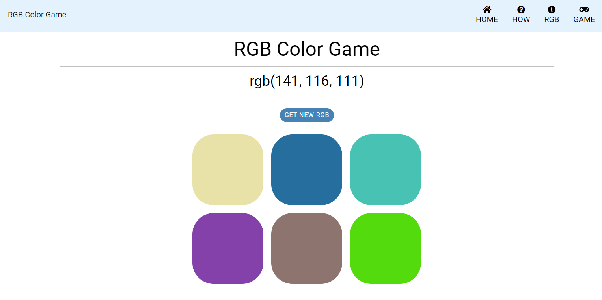
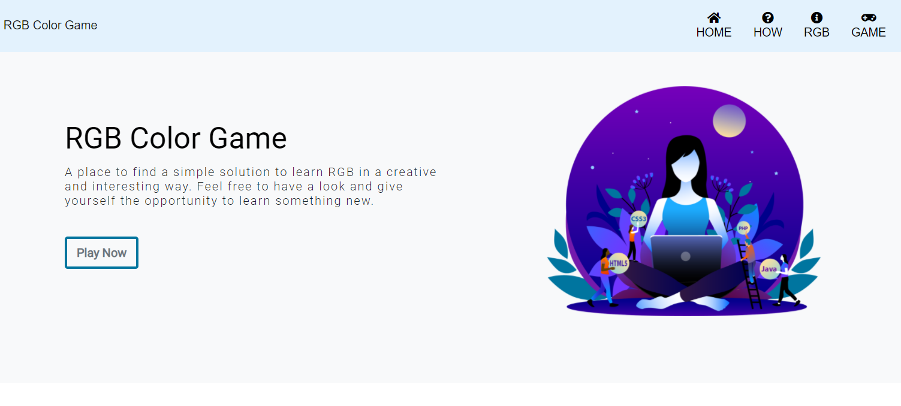
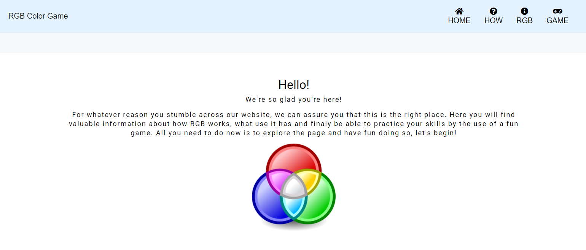
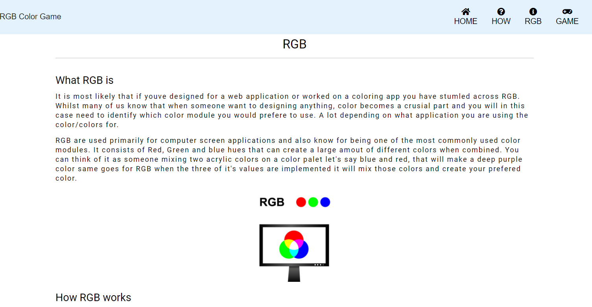
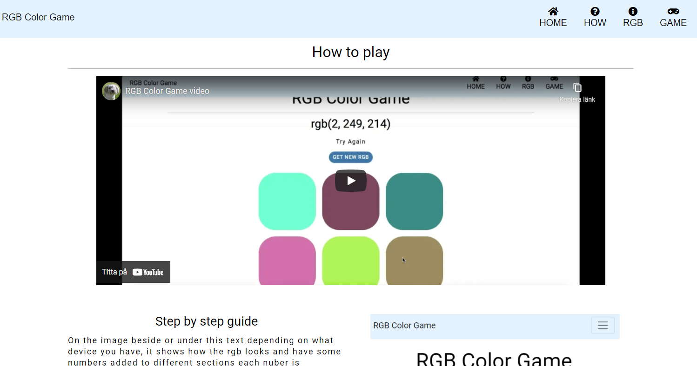

# RGB Color Game 

Welcome to RGB Color Game 
This is the website built to give users a bigger understanding and basic knowledge about what RGB is and how to recognize it's value. With this you will find a page that explain the concept for RGB as well as how the game provided works to help the user find a easy way to learn the over all structure of the color module. The purpous for this is to give the one curcious a easy way to learn the structure of RGB so that it becomes easier to use whenever neccessary. 

### Showcase

Live <a href="http">Website</a>

# Navigation 
 * UX 
  * UX Stories 
  * First Time Visitor Goals
  * Returning Visitor Goals
  * Frequent User Goals
 * Strategy
  * User needs 
  * Business vision
 * Scope 
 * Structure 
 * wireframes 
    * Changes to wireframes
 * Features
    * Existing features
    * Features Left to implement 
 * Technologies 
    * Languages
    * Libraries and online resources 
 * Testing
  * Testing plan  
  * Results
  * Bugs 
  * Unfixed Bugs
 * Deployment
 * Credits
 * Content 
 * Media 
 * Acknowledgements

## UX 

As for the end user of this site one will find easy explenation of RGB and a fun way to test one self of what they learnt through a game  to get a bigger understanding of how to recognize it's values. The end user will therefore want to find a easy description of the items listed: 
* Presentation of the game
* Explenation of rgb, how it works and what it is
* Explenation of how the game works in text and as a video
* A game to help the user explore the values of rgb

The final goal is to provide knowledge and understanding of the color module rgb that can be used by several different types of people no mather the type of profession they aim towards to use it in. The biggest part is that it is supposed to be a simple and fun way of learning so that the website can provide more curiosity and inspiration. 

### UX Stories 

* As a user I want to learn more about RGB 
* As a user I want to Find simple instructions about RGB
* As a user I want to have a game to test what I learnt of RGB
* As a user I Want to find simple instructions on how to play the game provided 
* As a user I want to feel insipired while learning about RGB

### First Time Visitor Goals

* a. As a first time visitor I want quick and easy understanding about the main purpous of the website
* b. As a first time visitor I want easy navigation that takes me to my prefered information or playground on the website
* c. As a first time visitor I want a section that gives me a clear description of how the game works
* d. As a first time visitor, I Want a section that clearly describes RGB 
* e. As a first time visitor I want good basic knowledge in RGB

### Returning Visitor Goals
* As a returning visitor, I want to have easy access to the RGB color game
* As a returning visitor, I want to quickly find the information about RGB
* As a returning info I want to easily find the infromation about how the game works, in case I don't rememeber

### Frequent User Goals 
* As a frequent user I want to easaly find the RGB color game

## Strategy 

### User needs 
For me as a user the site must be accessible on mobile, tablet and all browsers. The text, information and layout sould be clear and easy to understand. The site should have simple navigation that makes me as a user comfortable directly when turning to the page by not struggeling to find the different pages of the site. As a user I want a site that gives me a quick way of finding different sections of the information and game page.

### Business Vision 
This might not be too much of a site that is made to earn something on, yet as a beginner developer I see this as a way earning greater experience and giving more people the chance to learn something about coding. Therefore I see this as a way of earning more knowledge among more people so that the business in the developing field can grow bigger and become even better in the future. The main purpose is therefore to provide good knowledge in what rgb is, and a fun way of learning it. Something that in the future might be a good business that could sell fun games and sites that provide quick knowledge for people wanting to learn something new. 

# Scope
What this website want is to give their users a much easy way of learning the basics of RGB, a place to test what they learned and a place to continuously come back to and exercise their knowledge on.

# Structure 
This website is a multipage site, with one page that holds all the infromation and one that holds the game itself. The information is provided into sections that makes it quick and easy for the user to find through the navigation bar prefered information by not being too overwhelmed of what there is to explore. This followed up with clear headings that explains the main purpous of the specific sections and pages. For this the user will find four different sections on the navigation bar Home that leads to the first page one lands on when visiting the site, and also the page that holds all the sections with information. Secondly the Game page that is determined for the game and the game only, with still a navigationbar provided in case the user want to go back and read som more information. The remaining navigations is for the sections one for the RGB explenation and one for the How to play the game explenation. The over all look of the pages is to stay consistent and minimal with images provided for either informative purpouses or styling. For UX purposes the pages are also staying in the same type of layout, to not disorient the user. Overall the user have then the option to look around on the website either trough scrolling by theself or by following the naviagtion menu. 

# Wireframes 
Original wireframes can be found here: <a href="assets/img/wireframe-one.png">wireframe 1</a> <a href="assets/img/wireframe-two.png">wireframe 2</a>

### Changes to wireframes 
After having a meeting with my mentor Antonija Simic there was a few changes to be made for my wireframes, first was to not use icons under each of my headings for the sections of the home page. Secondly was to make the game fit the whole screen of it's page and also implement button that holds the change color rendering that reset the squares to have new colors displayed instead of a stripe under the heading that will help the user to more easy understand what's going on when playing. 

# Features 
This website is designed to inform the user, and give them valuable understanding of what RGB and a RGB color module is, that means that each and every section to the page and pages are designed with that concept in mind, wich will be explained futher into detail down bellow.

### Existing Features 
* Navigation Bar
   * The navigation bar is designed to always stay with the user trough the site, with a minimal and simple look and some icons as well as text showing what the user can find and quickly take them there. This also provided with a smaler line that when the user hover their mouse over the options of the menu they can easy see where they are looking. 

* The header section 
   * Here the user is presented with one image to give the header som style and make the over all look a little bit more fun.
   * Holds a heading of the name for the "Coompany"
   * Holds a smaler text explaining the whole purpous of the site in a welcoming way
   * Holds a button with a hover effect that lead the user to the game right away.
   * Also holds the navigation that will remain whilst scrolling
   

* The welcome Section 
   * Heading that welcome the user even more 
   * Some text that want the user to feel welcome and get a bigger understanding of what the purpous of the site is
   * Image that show a quick look of how the rgb module looks
  

* RGB section 
   * Main heading of the name RGB
   * Smaler headings telling what the text is about
   * Here the user is provided with text that tells all about RGB
   * A image is provided to demonstrate how rgb is overlapping with it's color  
 

* How to play section 
   * Heading of How to play, so the users knows what section they are on 
   * A video displayed for the user to watch showing how the game works 
   * Smaler heading telling step by step 
   * Step by step text of how the game works
   * Image to the right or under(if on smaler screen) the step by step text with numbers following the step by step text
  

* Game page 
   * Heading of the name for the game
   * RGB value displayed under heading
   * Button proving new colors and RGB value 
   * Squares with colors to pick from when playing the game 
   * Text displayed when the user plays the game so he or she knows if the answer is correct or not
   * Also provided with the navigation bar that stays with the user on scroll
    

### Features left to implement 
I would belive that for every website there are tons of features that could be implemented, yet for this I have found a few that would be of more use and value to implement for this particular website. All of which you find listed bellow:

* Insert two extra buttons for the game that holds a easy and hard function, the hard function then holding a timer that gives the user let's say 15 secounds to find the right color on.
* For the game a  system that also takes points scored for each correct answer and store these in a scoreboard bellow the game. So the user always can come back and compete with them selfe to always try to do a little bit better than the last time. 
* Even deeper explanation of rgb and maybe also a rgb rendering "machine" that can let the user play around by clicking on different colors and for themself see what value their preferred color has.
* More information about rgb and maybe some links that lead to more pages explaining rgb. 

## Thecnologies

For this project following thecnologies was used

### Languages 
 * HTML 5
 * CSS 3
 * JavaScript  

### Libraries and online resources 
* Bootstrap V5.0.x used to create a responsive website, navbar, use of libraries and documentation. <a href="https://getbootstrap.com/docs/5.0/components/accordion/">Bootstrap</a>
* Google fonts to have a more suitable font for the site <a href="https://fonts.google.com/specimen/Roboto?thickness=6">Google fonts</a>
* Font awesome to implement icons on navigation bar <a href="https://fontawesome.com/">Font Awesome</a>
* Github for use of saving and publishing the code for the website <a href="https://github.com/">Github</a>
* Gitpod for the use of creating the code <a href="https://gitpod.io/workspaces">Gitpod</a>
* Colors to help find a template for the theme colors of the website <a href="https://coolors.co/ca054d-3b1c32-a4d4b4-ffcf9c-b96d40">Colors</a>
* Iconscount for their use of all images of the page <a href="https://iconscout.com/free-illustrations">Iconscount</a>
* Lighthouse for testing performance and accessibility of the site existing in google devtools 
* Google Chrome Devtools: for testing the site and how responsive it is
* To create wireframe used <a href="#">wireframe.cc</a> 
* Validators to test my code <a href="https://validator.w3.org/">W3C</a>,<a href="https://www.jslint.com/">Jslint</a> and <a href="https://jigsaw.w3.org/css-validator/">Jigsaw</a>
* w3school to help me find simple solutions as for styling css <a href="https://www.w3schools.com/html/html_links.asp">w3school</a>
* MDB bootstrap for helping me understand core concepts of bootstrap <a href="https://mdbootstrap.com/">MDB</a>

# Testing 

### Testing plan

* Chrome Devtools
My main goal with the layout was to make large screens have a horizontal display and on mobile devices vertical display, while on tablets or for exampel a ipad something inbetween those two. I designed the website mobile first and to do so I did extensive testing by using Chrome DevTools trough out my working process. This meant that everytime I implemneted a column with text or a image I went to the DevTools and changed settings so that I could see how it would look on for example Iphone X (with screen size 375 x 812) Iphone 6/7/8 plus (screen size 414 x 736), ipad (screen size 768 x 1024) and laptop (screen size 1440 x 900).
Secondly chrome devtools was also a way for me to now see if some of my javascript code was rendering as well as for my overall code a helping hand to detect bugs and find ways to fix them by first trying in the developer tools section and then see if I found a solution or not. 

* Testing with friends, family and slack 
Still I am a beginner at coding and I take every oportunity to find ways to improve my code therfore I must implent this section this I belive it hase been a huge part trough when I have been testing my code. 
  * Mentor sessions where a big help when fixing small errors of my code that I couldn't see myself. Antonija saw dirrectly small changes that had to be done and it was trough here guidiance I figured out simple ways to improve my code. 
  * Thanks to my friends and family by sharing the link I had the oportunity to see so the link for the website was working, that it stayed responsive and also got feedback on how  it was to use and what could be improved from that. 

* Validator Testing 
* HTML
  * Errors found and debugged, two errors remaning in index.html (read more about them under results) 
  * Game.html no errors shown after debugging <a href="https://validator.w3.org/">W3C validator</a>
* CSS
   * After debugging no errors found and only a few errors remain (read under results) <a href="https://jigsaw.w3.org/css-validator/validator">Jigsaw validator</a>
* JavaScript 
   * One error and warnings remaning (Read about them under results) <a href="https://www.jslint.com/">Jslint</a>

* Testing was performed as follows: 
1. Write my code, go to Devtools to see how it looked on different screens so that it stays responsive. 
2. Sending live link of the website to people I know to see if it was working on their mobile devices. 
3. Letting my mentor review my code and see so that it looked right. 
4. Took my HTML code trough the W3C validator making sure there wasn't any errors or warnings. I took my code trough W3C validator first via the live version that already existed and then afterwards via direkt input of my code. 
5. Ran my CSS trough the Jigsaw validator trough direct input. 
6. Took the game.js code trough the Jslint validator by direct input.
7. using lighthouse to see the performance of the website.

### Results
* While coding I implemented the header image, and when looking att devtools I saw that this image made the screen of the site too wide. So wide I had to drag the site to the side to see the full page. So whilst using google dewtools I looked into what image was the issue and how maybe the width of it could be changed. It took me some tries to find the right class to implement a smaler width for the image yet after some testing the solution ended up with following boostrap grid system. 
* Html gave an error for my script tags, this because the script didn't exist inside of the body and was solved by moving the script tags inside the body. After that was fixed no more errors was found.
* Two errors remaning for index.html these are for the video implemented from youtube, the code has styling properties in it that I couldn't find a solution for to style by css. The issue then was that the video became too big and not responsive so I had to to leave these errors for now. 
* First one error for game.css for a class contained that wasn't of use, this being fixed by removing the class and no errors were found after passing through the official Jigsaw validator. One thing to note is that style.css and game.css remain with warnings for transition value because of not being known for every browser I believe, yet for now I wanted to keep those transitions anyway knowing about the warnings.
* The Jslint validator gave me mostly warnings of the code, many of them could be fixed by removing som extra comments that the code didn't need. Only a few of my warnings are left and after searching for solutions I found that what Jslint wants is me to put all my for and var variables on the top of the code. yet because I want to know where each and everything is and for what they work I let them remain in the same position and for now until I know a better solution "ignore" the warnings. 
* When I felt 99% finished with the website I also tested the performance of the site trough Lighthouse existing in google devtools. This giving me the performance of 91. 

### Bugs
* Images
   * I had a problem inserting images and not making them make the page be too wide on smaler screens. This resulted in me playing around on devtools and after trying to fix the problem in css, the solution ended up with giving width to every image on the html page. 
   * I inserted a function using javascript that helped me make the image in the header move when a user move the mouse, this resulted in removing cause it made the body of the page too wide and not responsive.

* Navbar navigation
   * Wanted to link sections with id's such as id=how and id=rgb in my navigation bar, it worked well in the index.html page but on the game.html these wasn't working. What I found was that I had given the a tag the wrong file path for the game.html page. What had to be done was that I had to write index.html#rgb in the a tags and the links was then working.

* Icons in navbar 
   * I had a problem making the icons in the navigation bar center over the name of the a tags. The issue was that I had to add a class from bootstrap named text-center and all the icons where then center on top of the a tags name. 

* The game
  * After making the JavaScript for the game after saving it in the assets folder the game wasn't no longer responding to the html page and even if it was a simple issue it ended up with that I had forgotten the right file path for the javascript script tag meaning before typing assets I had to implement ./ first. 

* Javascript
   * In my javascript one can find a function that creates a random rgb color, this had me sratching my head for a long time. The problem wast first to understand how to make such a function and I looked at w3schools website as well as youtube and stack overlfow to get a understanding. After that a solution was there but it wasn't working. The bug was a type where I had to put a space between each comma sign so that the calculation could be correct for the computer. 

* The style 
   * After a mentoring session I had to change the styling of the whole website from dark to light, I made this by making a new file and playing around on that with the old copied and pasted code. This resulted in me deciding to keep the new css file and remove the old style.css. Yet after saving and renaming the test css to style.css the code couldn't find the file and I had to rename the style.css to styled.css to make it all work again. But I believe my action was to quick because after trying to rename the file again back to style.css after a few days it worked and the error was solved.   

### Unfixed bugs
* One issue was for me to fix a easy and hard section on the game page. The idea was to insert a timer for the hard section that count down from 15 secounds yet the thing was for me that I didn't really find a solution for what would happen when the timer stops and what value it had when I for now haven't implemented a point system that could let's say remove one point from the one playing if they doesn't answer in time. Another solution could be to reset the colors for when the timer ends, yet for that it became too complex for me to implement the timer function and where to insert it and so on. So unfortunately this will still be a remaning issue for now I cant fix and therefore leave this site with no easy and hard functions. 
* Refactoring, this maybe goes a bit hand in hand with the unfixed bug bellow. But what I found was that in my javascript code for the game I would like to make it a bit more clean so that it would be easier for me to maybe implment new functions that could let the game do other things (as for example add a timer). But because of my limited knowledge in that area I left it for now and hope in the future to be able to do some refactoring. 
* After validating my javascript code there was one issue to fix, from what I understand this meant that I had to find a more clean way to write some of my code. I am much happy that I even got the code to work so for now I left that error. 
* In my Javascript code there is some functions that isn't of use for the game, I decided to leave them because when I started to remove some of them things stoped working for me and I got to scared of trying to clean the code.  
* I wanted to style all the images and the video on the css for the home page, yet when I did so it didn't show up on the screen and I had to put the styling for the images on the html page instead. A remaining issue I would like to fix to make the code more clean in the future. 

# Deployment 
The project was made with the help of Github and Gitpod. This by creating a repository on Github to then make the code on Gitpod development workspace, that in return meant that every time i made changes to my code or added something I had to push my code to Github so that the code then was saved on the local repository on github. Note that before pushing my code I made sure to add git commit messages in the terminal so that I always know what I have done in my code. 

To deploy the project I had to:
* Log in to Github and open the repository that I wanted to deploy
* Select settings, scroll down to pages section 
* Under the heading source choose master instead of none
* Make sure to save and refresh your page to confirm that the deployment is done

If you would prefer to run the project locally you should follow these steps: 
1. Log in to Github and open the repository that you wanted to deploy
2. Click on the repository then press the button code
3. There you will find Clone and Download ZIP
4. Open in your preferres IDE
5. Run your local server 

## Credits 

* Boostrap version 5 for their use of library and grid system <a href="https://getbootstrap.com/docs/5.0/getting-started/introduction/">Bootstrap</a>
* Fontawesome for borrowing their icons <a href="https://fontawesome.com/">Font Awesome</a>
* Shutterstock for inspiring my layout for the website, to help me understand RGB and their use of some images <a href="https://www.shutterstock.com/blog/rgb-definition-design-work">Shutterstock</a>
* Fontawesome for borrowing their icons <a href="https://fontawesome.com/">Font Awesome</a>
* I did not come up with the idea for the RGB color game and found the inspiration from FaithTower MediaTeck on youtube and have been using various different sites to help me follow this inspiration and create a similar looking game.<a href="https://www.youtube.com/watch?v=Dr-RUryVGA8&t=21s">FaithTower MediaTeck</a>
* jsndesign for making a random RGB generating function, understanding how I should create my tags that will send out the function to the game itself, how to make a function to generate random colors in a array and so on. If one look at their website you will see that I haven't copied and pasted their code just used it to understand how I myself can find a structure to build up my code <a href="https://jsndesign.co.uk/blog/javascript-rgb-hex-color-game/">jsndesign</a>
* W3school to understand for loop and how to work with math random as well ass implementing message and working with HTML DOM <a href="https://www.w3schools.com/js/js_loop_for.asp">W3school</a>
* MBD to help me understand how to work with bootstrap, making a header for the home page and how to implement a video <a href="https://mdbootstrap.com/docs/standard/content-styles/background-image/">MBD</a>
* Google fonts for the use of Roboto Fonts <a href="https://fonts.google.com/">Google fonts</a>
* clker I do not own any of these images on this site and is only used for educational purposes while therefore the credit for image called logo (2).png comes from <a href="http://www.clker.com/clipart-41598.html">clker</a>
* Stack overflow for helping me solve why my script tag under game.html gave an error <a href="https://stackoverflow.com/questions/19958667/stray-start-tag-script">Stack overflow</a>

# Content
All content for the code of the website has been created by the help of what I have learnt from code institute and the platforms listed under credits. A extra shoutout to <a href="https://www.shutterstock.com/blog/rgb-definition-design-work">Shutterstock</a> for inspiring me to find a layout for my website. <a href="https://jsndesign.co.uk/blog/javascript-rgb-hex-color-game/">jsndesign</a> for helping me get a understanding of how to even start building a RGB color game and lastly to <a href="https://www.youtube.com/watch?v=Dr-RUryVGA8&t=21s">FaithTower MediaTeck</a> that was the youtube video that inspired me to make a game like this. 

# Media 
All images where taken from different sources on the web, I do not own any of these images and will note that these are only in use of educational purpouses and the copyright belongs to the brands themself. You will find all the sources for the images linked bellow: 
* Header image on home page women.png <a href="https://iconscout.com/illustration/women-web-developer-with-laptop-2040890">iconscount</a>
* RGB circles image logo (2).png <a href="https://www.clker.com/clipart-41598.html">clker</a>
* Laptop rgb circles image RGB-profile.jpg<a href="https://www.shutterstock.com/blog/rgb-definition-design-work">Shutterstock</a>
* The image called RGB-Profile.jpg is made my me and the video inserted is made by me on a programe called <a href="https://www.movavi.com/mac-video-editor/">Movie Video Editor Plus 2021</a>

# Acknowledgements
I would like to acknowledge my Mentor Antonija Simic for her honest replys on my code and ideas and for being a helful guide when I didn't know what to do or how to even go forward. This has been a challeng for me and I would also like to acknowledge student suport for being much helful when I felt that nothing was working for me. 
